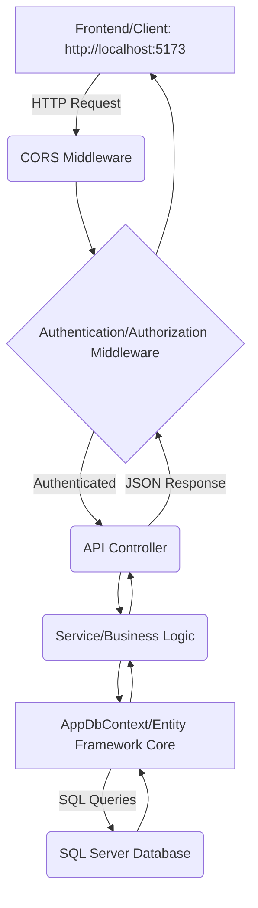

# DiaMate Web API 
<p align="center">
  
</p>
Welcome to the **DiaMate Web API** — a dedicated backend application built on ASP.NET Core to manage data, authentication, and services.
The system provides a secure, flexible API foundation using Entity Framework Core, SQL Server, and JWT Authentication.

---

## Table of Contents

1. [Project Overview](#project-overview)
2. [Architecture](#architecture)
3. [Technology Stack](#technology-stack)
4. [Project Structure](#project-structure)
5. [Features](#features)
6. [Getting Started](#getting-started)
7. [Configuration](#configuration)
8. [Modules](#modules)
9. [Data Flow](#data-flow)
10. [Database Setup](#database-setup)
11. [Business Rules](#business-rules)
12. [Error Handling](#error-handling)
13. [Testing](#testing)
14. [Support](#support)

---

## Project Overview

The **DiaMate Web API** is an ASP.NET Core application built to serve as a secure backend for a single-page application (SPA) or mobile client.

### Key Capabilities:

* **API Service**: Provides RESTful endpoints via Controllers.
* **Security**: Implements user authentication and authorization using ASP.NET Core Identity and custom JWT (JSON Web Token).
* **Data Management**: Uses Entity Framework Core with SQL Server for robust data storage.
* **CORS**: Configured for local development integration with a frontend running on `http://localhost:5173`.
* **Documentation**: Includes Swagger/OpenAPI for easy endpoint discovery and testing.

---

## Architecture

The project follows the standard **ASP.NET Core Web API** structure, utilizing dependency injection and middleware for configuration.

### Layer Structure:

#### 1. **Presentation Layer (API Endpoints)**

* Handled by **Controllers** which receive HTTP requests.
* The layer where routing, model binding, and authorization take place.

#### 2. **Service/Business Logic Layer** (Implied/Planned)

* *Note: While not explicitly shown in `Program.cs`, this layer will contain the core logic and service classes for data manipulation and business validation.*

#### 3. **Data Access Layer (DAL)**

* Implemented using **Entity Framework Core** and the `AppDbContext`.
* Handles communication with the SQL Server database.

---

## Technology Stack

### Core Technologies:

* **ASP.NET Core (Latest)**
* **C#** (Backend Language)
* **SQL Server** (Primary database)
* **Entity Framework Core** (ORM/Data Access)
* **ASP.NET Core Identity** (User/Role Management)
* **JWT (JSON Web Tokens)** (Authentication)

### Additional Tools:

* **Swagger/OpenAPI** (API Documentation)
* **CORS Middleware** (Cross-Origin requests)

---

## Project Structure

The structure is based on a single ASP.NET Core Web API project.
```
DiaMate/
│
├── DiaMate/                     # Main Web API Project
│   ├── Controllers/             # API Endpoints (e.g., AccountController)
│   ├── Data/                    # DbContext and Migrations
│   │   ├── AppDbContext.cs      # Database context
│   ├── Extentions/              # Custom services (e.g., JwtAuth)
│   ├── models/                  # EF Core entities (e.g., AppUser)
│   ├── appsettings.json         # Configuration files
│   └── Program.cs               # Service and Pipeline setup
│
└── DiaMate.sln                  # Visual Studio Solution File
```
---

## Features

### 1. User Authentication (Identity)

* User registration and login (via Identity).
* Role management (via IdentityRole).
* Secure token generation (JWT) upon successful login.

### 2. Authorization

* Secured API endpoints using JWT Bearer Authentication.
* Role-based access control (RBAC) (via `IdentityRole`).

### 3. Database Management

* Relational data stored in SQL Server.
* Data access managed via Entity Framework Core.

### 4. API Accessibility

* CORS configured for frontend development at `http://localhost:5173`.
* Automatic API documentation via Swagger UI.

---

## Getting Started

### Prerequisites

* **.NET SDK** (matching the project's target framework - typically .NET 8 or newer)
* **SQL Server** instance
* **Visual Studio** (Version 17.14.36327.8 or newer, as per the solution file )

### Steps to Run:

1.  **Clone Repository**
2.  **Restore Dependencies**
    ```bash
    dotnet restore
    ```
3.  **Update Database Connection**
    * Configure the `"MyConnection"` string in `appsettings.json` (see Configuration).
4.  **Apply Migrations** (Assuming migrations have been created)
    ```bash
    dotnet ef database update
    ```
5.  **Run the Application**
    ```bash
    dotnet run
    ```
    The API will start, typically accessible at `https://localhost:7xxx`.

---

## Configuration

### Database Connection

The connection string for SQL Server is referenced in `Program.cs` as `"MyConnection"`.


**Location:** `appsettings.json`

### JSON  
```
{
  "JwtSettings": {
    "SecurityKey": "YOUR_VERY_LONG_SECRET_KEY_HERE_MINIMUM_32_BYTES",
    "Issuer": "DiaMateAPI",
    "Audience": "DiaMateClient"
  }
}


```
```
{
  "ConnectionStrings": {
    "MyConnection": "Server=...;Database=DiaMateDb;User Id=...;Password=..."
  }
}
```
## Modules

### 1. Identity Module
- `AppUser` and `IdentityRole` management  
- Stores user credentials and profile data  

### 2. Data Module
- `AppDbContext` for managing tables  
- Handles CRUD (Create, Read, Update, Delete) operations  

### 3. Authentication Module
- Handles validation and generation of **JWT tokens**  
- Secures endpoints using the `[Authorize]` attribute  

---

## Data Flow


## Database Setup

The project uses **Entity Framework Core Code-First**.

### Required Models
- `AppUser` (inherits from `IdentityUser`)
- `IdentityRole`
- Additional domain models (e.g., `Patient`, `Reading`, etc.)

---

## Setup Steps

### 1. Create initial migration
```bash

dotnet ef database update

```
## Business Rules

- All endpoints requiring user-specific data must be protected by `UseAuthentication()` and `UseAuthorization()`.
- `UseCors("AllowLocalDev")` **must come BEFORE** `UseAuthentication()` and `UseAuthorization()` in the middleware pipeline.
- A user must possess a **valid JWT** to access secured resources.
- Additional domain-specific rules will be implemented in the **Service/Business Layer**.

---

## Error Handling

### HTTP Status Codes
- **200 OK**
- **201 Created**
- **400 Bad Request**
- **401 Unauthorized**
- **403 Forbidden**
- **404 Not Found**

### Validation
- Model validation inside **Controllers**
- Business-level validation inside the **Service Layer**

### Database Exceptions
- EF Core exceptions should be **caught** and mapped to meaningful **HTTP responses**.

---

## Testing

### API Testing (Manual / Postman)
- Test secured endpoints **with and without a valid JWT**
- Verify **CRUD operations** for core models
- Test **successful user registration** and **token generation**

---

## Future Enhancements
- Unit tests for Controller and Service Layer
- Integration tests covering the **API request pipeline**, including database access

---

## Support

If something doesn’t work:

1. Verify the `"MyConnection"` string in `appsettings.json`
2. Ensure latest **EF Core migrations** are applied
3. Confirm `JwtSettings` values (`SecurityKey`, `Issuer`, `Audience`) are correct
